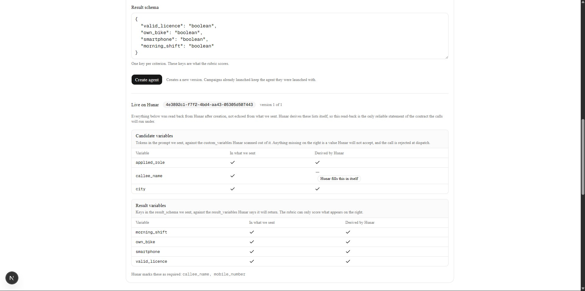
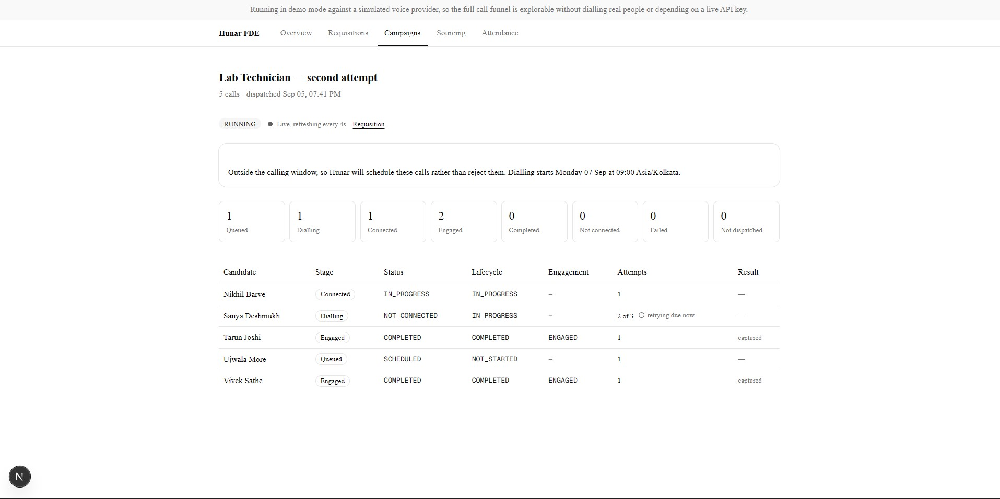
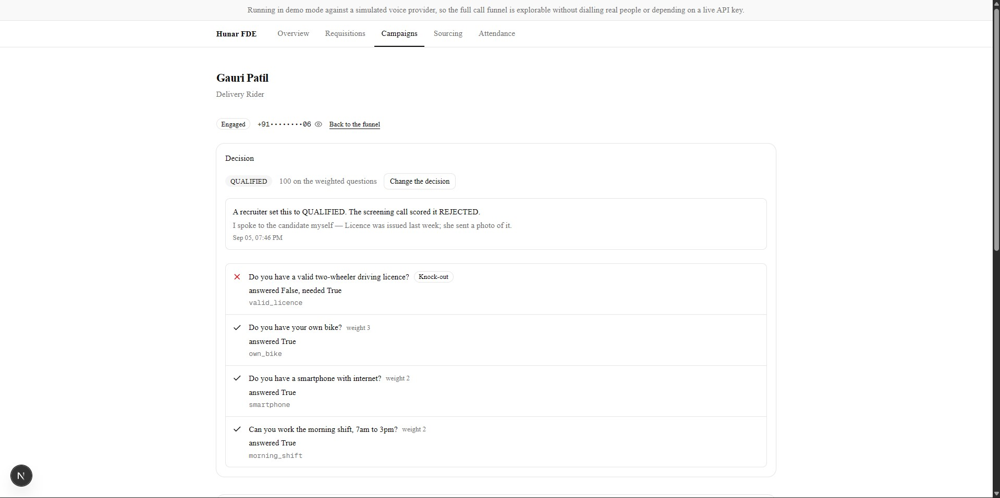

# Hunar.AI — Forward Deployed Engineer assignment

Three things were asked for: an AI hiring assistant for inbound applicants, a
people-search and reachout tool for outbound candidates, and a written design for
tracking attendance without smartphones. I built the first two as **one
application with two entry points into one funnel**, and wrote the third as a
document. Inbound and outbound differ only in how a candidate enters the system;
after that it is the same agent builder, dispatch, webhooks, reconciliation and
review screen. Building them separately would have meant maintaining two call
pipelines to demonstrate one.

## Links

| | |
| --- | --- |
| **App** | https://hunarai-assignment.vercel.app |
| **Attendance design (item 3)** | https://hunarai-assignment.vercel.app/attendance |
| **API** | https://hunar-fde-backend.onrender.com/docs |

The first load takes 30 to 60 seconds: Render's free tier sleeps after 15 minutes
idle. The UI says so rather than showing a silent spinner.

## Screenshots

**The agent panel.** One list of criteria generates the prompt, the
`result_schema` and the rubric, so they cannot drift apart. After creation it
shows the variables Hunar *derived* beside the tokens we *sent* — the vendor
computes `custom_variables` from the prompt text, and a disagreement is a 422 at
dispatch.



**The live funnel.** Eight stages derived from Hunar's two status fields. A call
between retry attempts is shown as retrying with its next attempt time, not as
failed.



**Candidate detail.** The rubric criterion by criterion: what was asked, what was
said, whether it passed. A recruiter override sits beside the computed decision
rather than replacing it.



## Live call evidence

Two real calls were placed against the Hunar API on 5 September 2026 and every
webhook captured; full findings in `backend/fixtures/observed_shapes.md`. Run 2
was answered by a human, ENGAGED, 30 seconds. Measured from `ended_at`:

| Offset | Event | Carries |
| --- | --- | --- |
| +12s | `call_status_updated` | status only, no result, no recording |
| +23s | `call_recording_done` | `recording_url` |
| +27s | `call_result_done` | `result` |
| **+372s** | `call_summary` | status, result and recording, all populated |

All six captured webhooks pass signature verification unchanged. Two undocumented
behaviours here are load-bearing: `call_summary` trails the call by **six
minutes** because it waits for the maker-checker second pass, and the API returns
`result: {}` at the moment of COMPLETED. Terminal is not finished, so the system
keeps reconciling after a call ends and says so on screen.

<!-- Live-call screenshots to be added here once supplied. -->

## Architecture

The browser never talks to Hunar. Everything goes browser to our API to Hunar,
which is what keeps the key off the client, lets every response be validated
against shapes we control, and makes the recording proxy possible.

- **Frontend** — Next.js App Router on Vercel, TypeScript strict, Tailwind, shadcn/ui
- **Backend** — FastAPI on Render, SQLAlchemy 2 async, Alembic, uv
- **Database** — Neon serverless Postgres, Singapore
- **Scheduling** — cron-job.org: a keep-warm ping every 10 minutes, reconciliation every minute

**The non-obvious decision: reconciliation is the primary source of funnel state,
not webhooks.** That is a measurement, not a preference. Run 2 moved through five
statuses in about ninety seconds and delivered **exactly one**
`call_status_updated`, at the terminal transition — nothing for
`SCHEDULED → INITIATED`, `INITIATED → RINGING`, or `RINGING → IN_PROGRESS`. Run 1
behaved identically with the catcher running throughout, so a webhook-driven
funnel would sit still until each call ended. `services/reconcile.py` polls
`GET /calls/{id}/` for anything not terminal and the campaign endpoint reconciles
before responding, which is why polling the page is what makes it move. Webhooks
still carry the result payload and the recording URL, but they repair the record
rather than drive it.

## Running it locally

```bash
cd backend
cp .env.example .env          # fill in DATABASE_URL at minimum
uv sync
uv run alembic upgrade head
uv run python scripts/seed_demo.py     # optional, wipes and seeds the demo
uv run uvicorn app.main:app --reload

cd ../frontend
cp .env.example .env.local
npm install && npm run dev
```

| Variable | Required | Notes |
| --- | --- | --- |
| `DATABASE_URL` | **yes** | The only one without a working default. |
| `DEMO_MODE` | no | Defaults to `true`. `false` places real, billable calls. |
| `PUBLIC_BASE_URL` | no | Where webhooks are delivered. Defaults to Render's own URL. |
| `HUNAR_API_KEY` | for live mode | Also the key inbound webhook signatures are verified against. |
| `DEMO_WEBHOOK_SIGNING_KEY` | no | Generated per process. Set it to survive restarts. |
| `INTERNAL_API_TOKEN` | for cron | Bearer token for `/internal/*`. |
| `PEOPLE_SEARCH_PROVIDER` | no | `fixture` or `pdl`. Defaults to `fixture`. |
| `PDL_API_KEY` | for live search | Free tier is 100 records a month, and each result spends one. |
| `GEMINI_API_KEY` | no | Job-description parsing falls back to keyword extraction without it. |
| `NEXT_PUBLIC_API_BASE_URL` | **yes** (frontend) | The only public variable. No secret ever belongs in one. |

`GET /health` reports `demo_mode` and the live people-search provider, so what is
actually wired up can be checked from outside rather than taken on trust.

## Demo mode

The Hunar trial key expires three days after issue, and you cannot dial real
people to demonstrate a voice product in a review meeting. So `DEMO_MODE` swaps
the `VoiceProvider` implementation and nothing else.

The simulator is not canned responses. It **signs real webhooks with HMAC-SHA256
and POSTs them over HTTP to our own receiver**, which verifies them through the
same path a live Hunar callback takes. Timings are compressed from those measured
above, with the real values in the comments. The deployed instance ships in demo
mode with `PEOPLE_SEARCH_PROVIDER=fixture`, so nobody clicking around the live
link can place a call or spend a search credit. `DEMO_MODE=false` with a valid key
makes it dial.

## Known constraints

**PDL's free tier withholds phone numbers**, substituting the literal boolean
`true` for a gated field rather than null: `mobile_phone: true` means "we have
one, your plan does not include it". Contact resolution is therefore its own
pipeline stage that may fail, and every record carries a badge naming which
resolver produced its number. Hiding that would make the demo a lie that only
breaks in production.

**No WhatsApp transport is wired.** The `NotificationChannel` interface exists
with a logged implementation; the Twilio adapter is not. A live integration is
invisible to a reviewer anyway — Twilio's sandbox needs each recipient to send a
join code, Meta's test number allows five — so a rendered outbox showing
template, recipient, trigger and timestamp is the better artifact.

**A dispatched call cannot be recalled.** The API offers no cancel or delete for
a scheduled call, and a campaign launched outside the calling window is *accepted
and scheduled*, not rejected. Mitigated by validating the window before dispatch
— it is 08:00 to 21:00, both bounds found by hitting them — and by stating the
real dial start time on the confirmation. But once Hunar accepts a call, it will
place it.

**No authentication.** Recruiter overrides are attributed to the constant
`"recruiter"` in `audit_log` rather than to a fabricated user id. Identity is the
largest gap between this and something shippable.

**Frontend types are hand-maintained**, not generated from the OpenAPI schema. A
generated client is a large file nobody reviews plus a regeneration step that
goes stale silently. The trade is stated in the file: a backend field rename
typechecks, builds, and is `undefined` at runtime.

**The recording proxy does not support Range requests**, so seeking within a long
recording will not work. Recordings are proxied rather than linked because Hunar
returns a raw S3 URL, and putting that in a page makes a recording of someone's
phone call permanently reachable by anyone who reads the HTML.

**Data retention.** Nothing expires: recordings, extracted results and phone
numbers persist until the database is dropped. A real deployment needs a
retention policy and a deletion path before it touches anyone's data; the seed
script's wipe is a development convenience, not one.

## What I would do next

- **Authentication and real actor identity**, so `audit_log` records who
  overrode a decision instead of that someone did.
- **Range support on the recording proxy**, so a recruiter can skip to the part
  of a two-minute call they care about instead of listening from the start.
- **`reconcile_stopped_reason` surfaced in the funnel**, not only on the
  candidate detail. The call list already distinguishes "still settling" from
  "we gave up"; the stage counters do not.
- **A scheduled-call cancel path** the moment Hunar exposes one, and until then a
  pre-dispatch confirmation that names every number about to be called.
- **Interview slot booking and the messaging outbox.** Both are modelled in the
  schema, neither is built — the first things cut once the live capture showed
  reconciliation needed more work than planned.
